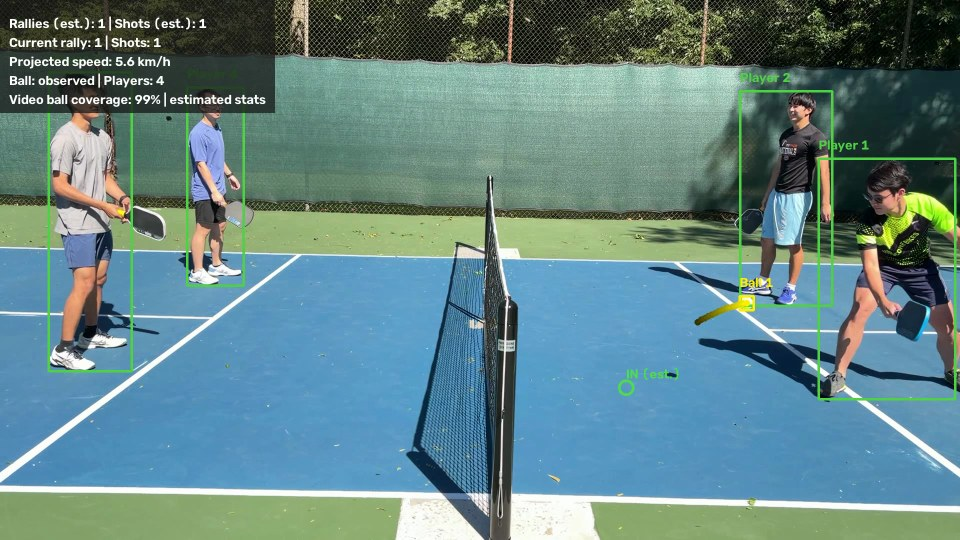

# Vantage — offline pickleball video analysis

A Python CLI that runs pretrained YOLO26 nano with ByteTrack for players and
a separate motion tracker for the ball on one fixed-camera video. It calibrates
the court with four clicks and exports an annotated video and estimated statistics.
No model training, web server, or real-time requirements.

## Side-view demo

[](docs/sideview-annotated.mp4)

[Watch or download the annotated side-view video](docs/sideview-annotated.mp4) (MP4, approximately 20 seconds), showing player and ball tracking with the stats overlay.

## Setup and run

Python 3.10+ is supported; Python 3.13 is the tested environment.

```bash
python3 -m venv .venv
source .venv/bin/activate
python -m pip install -r requirements.txt
mkdir -p input
# Put your fixed-camera game video at input/sample.mp4, then:
python main.py --input input/sample.mp4
```

For the video already supplied with this project:

```bash
python main.py --input assets/videoplayback.mp4
```

`--input` defaults to `input/sample.mp4`; `--output-dir` defaults to `output`.
Missing input produces an actionable error before importing the ML libraries.
Paths are relative to the current working directory. For offline processing,
first install requirements and download `yolo26n.pt` while online:

```bash
python -c 'from ultralytics import YOLO; YOLO("yolo26n.pt")'
```

`lap` is explicitly installed because ByteTrack needs its assignment solver;
this prevents Ultralytics trying to install it during an offline run. A desktop
OpenCV build (`opencv-python`, not the headless build) is needed for first-time
calibration. CPU is the portable default. Apple Silicon users may change
`CONFIG["detection"]["device"]` to `"mps"`; CUDA users can choose `"0"`.

## Court calibration

On the first frame, click the **outer court corners** in this order:

1. Near-left
2. Near-right
3. Far-right
4. Far-left

Press **Enter** to confirm, **R** to reset, or **Esc** to cancel. The preview is
scaled for your display; saved coordinates use original pixels. The court maps
to x=0–6.10 m and y=0–13.41 m, with the net at y=6.705 m.

The program saves `output/homography.npy` and `output/calibration.json`. A matching
calibration is reused on subsequent runs. If the camera moves, zooms, or crops,
run `python main.py --recalibrate`. A resolution mismatch triggers recalibration
automatically. For separate camera setups, use separate output directories.

## Outputs

- `annotated.mp4`: source FPS and dimensions, player boxes/IDs, detected ball box,
  a fading 15-position trail, estimated IN/OUT bounce markers, and estimated
  rally/shot counts. Yellow is observed ball evidence; orange hollow points are
  interpolated/coasted positions. Missing-ball status is explicit. Near-line
  bounce calls show a question mark. Audio is not copied. Odd input dimensions
  receive one black padding pixel for MPEG-4 compatibility.
- `stats.json`: video metadata, rally count, shots per rally, longest rally in
  estimated shots, average projected speed in km/h, timestamped bounce calls,
  rally details and per-rally ball coverage, player-track visibility, and
  data-quality warnings. Track counts are not unique-player counts. The
  `quality.status` field distinguishes insufficient, limited, and heuristic evidence.
  Schema version 2 also records input/tracking provenance for validated reanalysis.
- `tracks.jsonl`: one record per frame with timestamps, native-pixel player,
  paddle, and selected ball boxes and confidences. Players have ByteTrack IDs;
  confirmed balls have independent motion-track IDs; raw paddles have null IDs.
  IDs are scoped to their object class.
- `landing_heatmap.png`: top-down estimated bounce density with landing dots,
  outside-court margin, candidate counts, and ball-observation coverage.
- `events.jsonl`: timestamped net-crossing, bounce, and paddle-hit-candidate evidence, with
  event IDs and heuristic flags for review against the video.
- `homography.npy` and `calibration.json`: reusable court calibration.

Stdout contains **only the final statistics JSON**. Progress and diagnostics go
to stderr, so redirecting is safe:

```bash
python main.py --input input/sample.mp4 > run-stats.json
```

Detection and rendering use two video passes. Only compact records are retained,
not decoded frames. The output is fully decoded to verify frame count and format
before final artifacts replace previous results. Failed processing leaves prior
results intact. The five output files are replaced individually after success;
this is not a transactional multi-file filesystem commit.

## What the estimates mean

- A **shot** is a supported crossing of the projected net line, not a detected
  paddle impact. Serves or shots that do not cross are not counted.
- A **rally** is a group containing at least one crossing, separated from the next
  group by at least two seconds of ball loss or inactivity. It is not official
  scoring and can split a real rally when detection is poor.
- **Speed** is smoothed 2-D displacement on the court plane, using consecutive
  observed frames and excluding projection spikes. A homography cannot recover
  an airborne ball's 3-D position or true speed.
- A **bounce candidate** has supported descending/ascending image-y motion and a
  better piecewise fit than a straight line. Nearby paddle detections suppress
  some hits, but perspective and missed paddles still cause ambiguity. Bounds
  include the lines; near-boundary calls carry an uncertainty flag. Candidate
  contacts projected more than 2 m outside the court are rejected because airborne
  turns near the projection horizon can otherwise produce extreme false OUT calls.
  Remaining contacts still require visual validation.
- Ball gaps up to 0.20 s can be interpolated. Up to 0.10 s of coasting is used only
  for display. Events are never inferred from coasting or across long gaps;
  crossings require uninterrupted observed evidence. Track changes split paths.
  Ball acquisition requires two moving observations
  within 0.20 s. Short gaps retain the ball identity without producing measurements;
  longer losses require confirmation and a new identity. Stationary candidates are
  suppressed heuristically, so a resting ball may intentionally be unreported.
- Generic COCO weights often miss small pickleballs and pickleball paddles.
  Motion tracking cannot recover observations that the model never produced and
  may still follow moving false positives or balls on adjacent courts.
  The pipeline still writes a watchable annotated video when no ball is found.
  Speed is then `null`, and counts are accompanied by insufficient-evidence
  warnings. Zero counts are not proof that no play occurred.

The timing model uses frame index / source FPS and writes constant-FPS output.
Convert variable-frame-rate footage to constant FPS first if exact timing matters.
Recording new footage at 60 or 120 FPS can provide more actual observations of the
ball, subject to lighting, exposure, resolution, and device throughput. Converting
30 FPS footage to 120 FPS, or slowing playback, adds no measured positions. Analyze
high-frame-rate footage at its original capture timing; slow-motion exports can
otherwise distort speed estimates. The ball tracker uses seconds rather than frame
counts for its motion and loss handling.

The camera must remain fixed throughout the clip, and all four court corners must
be identifiable. People outside the court can also be detected as players.

## Configuration and code structure

All tunable parameters, units, colours, and thresholds are commented in the one
`CONFIG` dictionary in `config.py`. To switch models, replace its `model` entry:

```python
"model": {"path": "pickleball.pt", "classes": {"player": 0, "ball": 1, "paddle": 2}},
```

The default is `yolo26n.pt` with COCO person=0, sports ball=32, tennis racket=38.
There is no fallback download of a different model if loading fails: failures
name the requested weights and explain how to prepare an offline run.

| File | Responsibility |
| --- | --- |
| `main.py` | CLI, input checks, two-pass orchestration, output publication |
| `config.py` | Model/class mapping and all tuning parameters |
| `records.py` | Shared typed frame, detection, trajectory, bounce, rally records |
| `tracking_cache.py` | Validate cached observations against input, settings, and checksum |
| `motion_stream.py` | Causal coordinates, per-track distance, projected speed, and hit candidates |
| `detector.py` | One raw YOLO pass, player-only ByteTrack, raw paddle observations |
| `ball_tracker.py` | Ball acquisition, velocity prediction, motion matching, loss/reacquisition |
| `court.py` | Calibration UI, validated cache, projective mapping |
| `ball_physics.py` | Segments, smoothing, interpolation/coasting, bounce estimates |
| `stats.py` | Crossings, rally grouping, speed, quality metadata |
| `visualize.py` | Overlays, fading trails, video writing and decode verification |
| `heatmap.py` | Court diagram, event density, landing dots, and verified PNG export |

## Tests

```bash
python -m unittest discover -v
```

Tests use synthetic trajectories and generated MP4 files, including an injected
detector; they do not download weights or open calibration windows. They cover
calibration geometry/cache validation, ball motion association at 30/120 FPS, raw
detection routing, missing data, track changes, bounce/paddle ambiguity, boundaries, crossings, rally grouping, speed,
no-ball output, stdout JSON, and failed-run cleanup.

Tested dependency versions: Python 3.13.7, Ultralytics 8.4.159, OpenCV 5.0.0.93,
NumPy 2.5.3, and lap 0.5.13. The requirements use compatible ranges so Python 3.10
can resolve releases that still support it.

Reference: [Ultralytics tracking API](https://docs.ultralytics.com/modes/track/).

## Ball tracking diagnostics

Run `.venv/bin/python diagnostics/check_ball_detection.py --max-frames 900` to compare
raw YOLO ball candidates with motion-tracker selections on the first 900 frames.
See [diagnostic instructions](diagnostics/README.md). Candidate coverage is not
accuracy; visual or labeled evaluation is needed to assess false positives.

See [motion-tracker results and validation](diagnostics/ball-motion-findings.md) for
the existing recording’s before/after comparison.

## Combined video and statistics

Normal runs produce player IDs, independent ball IDs, a ball trail, cumulative
estimated shot/rally counters, current-rally status, projected speed, and full-video
ball coverage in the same annotated video. Ball observations, interpolation, and
coasting remain visually distinct. Numbers are heuristic evidence, not official
match scoring, player identities, or verified line calls.

After a completed run, change the statistics/trajectory/bounce configuration and run:

```sh
python main.py --input assets/videoplayback.mp4 --output-dir output/combined --reanalyze
```

This reuses the completed tracking observations and recalculates statistics, events,
and overlays without loading model weights or running inference. It checks the
source path/size/modification time, dimensions/FPS, tracking configuration, record
count/timestamps, and a SHA-256 checksum of the observations. Changing the video or
tracking settings requires a normal run. Existing pre-cache outputs must also be
regenerated once. Calibration may be updated with `--recalibrate --reanalyze`.

The combined sample run is saved under `output/combined/`; earlier output files
remain available as the baseline.

## Streaming coordinates to the console

To process a video and print each frame as soon as it is tracked:

```sh
.venv/bin/python main.py --input assets/videoplayback.mp4 --output-dir output/combined --stream
```

To stream the existing validated tracking results without rerunning YOLO:

```sh
.venv/bin/python main.py --input assets/videoplayback.mp4 --output-dir output/combined --reanalyze --stream
```

Add `| tee coordinates.jsonl` to watch the stream and save it simultaneously. The
stream is newline-delimited JSON: one `stream_start` metadata line, one `frame` line
per video frame, and a final `summary` line. Every line is flushed immediately;
progress and warnings go to stderr. Output runs at processing speed, not necessarily
video playback speed. Cached replay may therefore print very quickly. The normal
annotated video, statistics, and event exports are still generated after tracking.
Without `--stream`, stdout remains a single final statistics JSON document.

Frame fields include:

- `frame_index` and `time_s`: original constant-frame-rate video timing.
- `players[]`: `track_id`, confidence, `box_px`, bottom-centre `footpoint_px`,
  `court_m`, cumulative `observed_distance_m`, `projected_speed_m_s`, and motion status.
- `ball`: measured box, centre, confidence and ID, `court_projection_m`,
  `image_speed_px_s`, and `instant_projected_speed_kmh`. Missing balls are `null`.
- `hit_candidates[]` and `hit_candidate_count`: observed direction changes near a
  detected paddle. Candidates are emitted one frame after the potential contact,
  carrying both contact and emission timestamps. They are explicitly unverified.

Pixel coordinates start at the image's top-left, with x rightwards and y downwards.
Court coordinates are in metres from the calibrated near-left corner: x across the
court, y toward the far baseline. Projections too far outside the court, or clipped
player foot positions, are unavailable (`null`). The stream contains observations
only; it never passes interpolation or coasting off as detections.

Player distance is a **partial estimate per track ID**, using smoothed box-bottom
positions and a small movement threshold to reduce jitter. It excludes identity
changes, gaps, impossible jumps, and invalid projections. It can undercount curved
paths and short segments and still include box jitter. Fragmented IDs must not be
combined into a person's total metres run without identity association. Grounded
foot position is an approximation; pose estimation would improve it.

Ball speed is a 2-D court-plane projection, not true 3-D flight speed. Instantaneous
causal values can differ from the offline smoothed speed statistics. Paddle-hit
candidates require three consecutive same-ID ball observations, a sufficiently large
direction change, and a nearby paddle observation at the middle frame; a cooldown
limits duplicate candidates. Missed paddles/balls and false detections make these
incomplete and potentially wrong. `confirmed_hit_count` remains `null`.

`stats.json` also stores these estimates under `motion`, and `events.jsonl` includes
paddle-hit candidates alongside net crossings and bounce candidates. Net-crossing
shot estimates and paddle-hit candidates are separate metrics. Tuning parameters
are under `CONFIG['motion']`; `--reanalyze` recalculates them from the same tracks.

## Landing heatmap

Every normal run and `--reanalyze` run now exports `landing_heatmap.png` alongside
the video and statistics. It plots the temporally deduplicated bounce candidates
from `detect_bounces`, not every frame of the ball trajectory. Duplicate frame IDs
are removed defensively; distinct landings at the same position still count separately.

The diagram preserves court proportions, shows service and kitchen lines, and places
the far baseline at the top and the near-left coordinate origin at the bottom left.
Nearby out-of-bounds candidates stay outside the lines. Nonfinite coordinates and
points beyond the displayed margin are excluded, never clamped onto a court edge.
The image and `stats.json`'s `landing_heatmap` metadata report the included, excluded,
and duplicate counts. Inside/outside counts describe estimated locations, not verified
line calls. An empty result produces a labeled court with no inferred hotspots.

`CONFIG['heatmap']` controls the margin (2 m), spatial smoothing sigma (0.40 m),
resolution (60 pixels/m), and kitchen depth. Heat is normalized to this image's
peak: it shows relative concentration, not landing probability. Different videos'
colours must not be compared as absolute frequencies. White dots retain the actual
candidate locations beneath the density estimate.

The current sample image is [here](output/combined/landing_heatmap.png). It is labeled
**Estimated bounce locations** because incomplete detection and false bounce
candidates can bias the map. The full-video ball-observation coverage is shown
prominently; an empty far court is not proof that no balls landed there.

The PNG is encoded and reopened for verification in the staging directory. Failure
to generate it preserves the previously completed output artifacts. No additional
model or dependency is needed.
